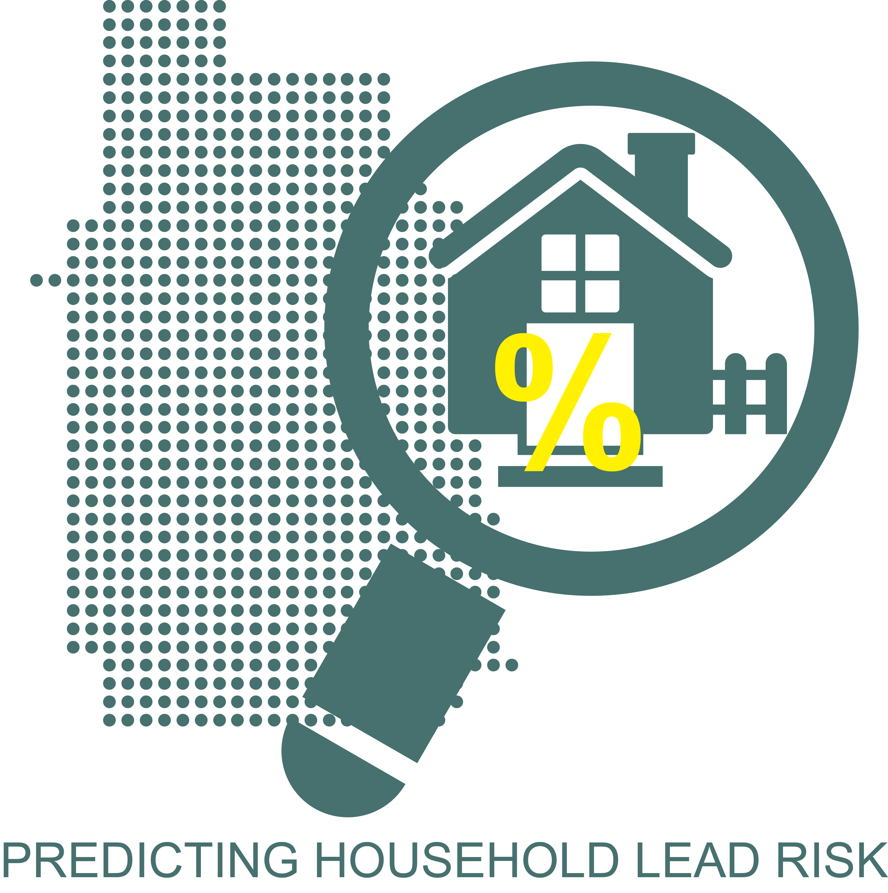

# Predicting Household Lead Probabilities in Minneapolis

### Javascript Final Project

As part of our work for the [MUSA Practicum class](https://pennmusa.github.io/MUSA_801.io/), we performed [an analysis](https://pennmusa.github.io/MUSA_801.io/project_4/index.html) to help the City of Minneapolis to proactively identify which residences likely have hazardous lead paint and should be targeted for remediation efforts. To display our results publicly, this is an application we made to display the outcomes of our analysis on a map to display predicted probability of lead at the parcel level.

Our aim was to create a web page from which residents or city officials could easily access additional information depending on their interests. Users curious about the process for developing the risk scores could access our full explanation of the modeling process through a hyperlink on the intro page. While those just wanting to understand their risk of household lead could jump right to the lead probability points. More interested users could fully explore a range of children’s elevated blood lead level data and census to see how they visually compare to instances of high lead risk. 
